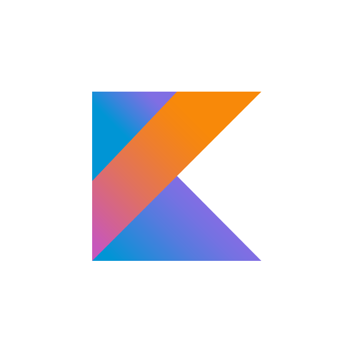
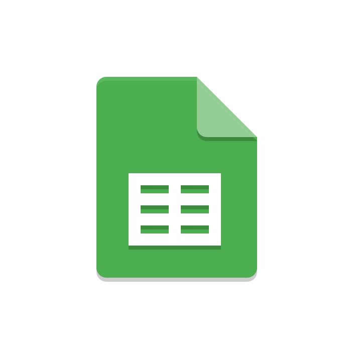

    

        
    

    

            <h3>BondoMan</h3>
            
<i>Transaction logging app for raw material trades</i>

    
      

<h1 align="center">BondoMan Mobile Application</h1>
BondoMan is an application centered around managing transactions efficiently. Users are required to log in initially to access its features, with the endpoint providing a token upon successful login for further access. The app enables users to manipulate transaction data, including addition, modification, and deletion, with minimal input requirements such as transaction title, category (Income, Expense), amount, and location, automatically recording the transaction date and user's location if permitted. Transactions are stored in Room using the Repository Pattern for offline access, displaying them comprehensively with details like transaction category, amount, name, location, and date. Users can add transactions, scan receipts, view transaction summaries via graphs, and export transaction lists to spreadsheets (xlsx or xls) for external viewing. BondoMan also features internet connectivity checks, providing alerts when offline, and incorporates a broadcast receiver in the transaction addition fragment for receiving intents from the "Randomize Transaction" button on the Settings Page.

## 📝 Table of Contents
- [General Information](#general-information)
- [Tech Stacks](#tech-stacks)
- [Libraries](#libraries)
- [Main Features](#main-features)
- [Bonus 1 - Twibbon Feature](#bonus-1---Twibbon-Feature)
- [Bonus 2 - OWASP Analysis](#bonus-2---OWASP-Analysis)
- [Bonus 3 - Accessibility Testing](#bonus-3---Accessibility-Testing)
- [Task Division](#task-division)
- [Contributors](#contributors)

## 📢 General Information
Bandung Bondowoso, a project manager tasked with building a thousand temples, faces a daunting challenge. Given a project by Roro, who lacks understanding in project management triangles—budget, deadline, and quality—Bondowoso must complete the monumental task within a single night with limited budget and high-quality expectations. Amidst numerous transactions for purchasing raw materials, precise cost calculations are crucial to align with the initial budget plan, as Roro refuses to pay otherwise. Initially, Bondowoso records all transactions on stone tablets, but with the immense scale of the project, he seeks assistance from the Jin students at the Institute of Jin in their sixth semester to develop a financial management application. He trusts that they possess the intelligence to tackle such a task.

The application built for Bondowoso is tailored to run seamlessly on his Android device, aiding him in managing his finances for the temple construction project. With a focus on tracking transactions, ensuring budget compliance, and facilitating efficient resource allocation, the app is designed to alleviate Bondowoso's burden and streamline the financial aspect of the project. By providing a user-friendly interface for recording transactions, analyzing expenses, and generating reports, the application empowers Bondowoso to make informed financial decisions, ultimately contributing to the smooth progress of the temple construction endeavor.

## 👨🏻‍💻 Tech Stacks

<kbd>

</kbd>
<kbd>

</kbd>
<kbd>

</kbd>
<kbd>

</kbd>
<kbd>

</kbd>
<kbd>

</kbd>

<h4>Kotlin | Google Maps | GMail | Room-SQLite | Spreadsheet | Android Studio</h4>

## 📖 Libraries
Here's list of libraries that used in this project.
<table style="width:100%">
  <col width="35%">
  <col width="65%">
  <tr>
    <th>Libraries</th>
    <th>Purposes</th>
  </tr>
  <tr>
    <td>com.squareup.retrofit2</td>
    <td>Type-safe HTTP client for Android for making HTTP requests to a RESTful API.</td>
  </tr>
  <tr>
    <td>androidx.recyclerview</td>
    <td>Efficiently display large sets of data in a scrollable list or grid format while minimizing memory usage and improving performance.</td>
  </tr>
  <tr>
    <td>androidx.camera</td>
    <td>High-level API for accessing device cameras and implementing common camera features such as preview and image capture.</td>
  </tr>
  <tr>
    <td>org.jetbrains.kotlinx:kotlinx-coroutines</td>
    <td>Provides support for Kotlin coroutines, which are a powerful concurrency design pattern used for asynchronous programming.</td>
  </tr>
  <tr>
    <td>androidx.room</td>
    <td>Provide an abstraction layer over SQLite, making it easier to work with a SQLite database within application.</td>
  </tr>
  <tr>
    <td>org.apache.poi</td>
    <td>Provide Java libraries for reading and writing various Microsoft document formats, such as Excel spreadsheets (.xls and .xlsx).</td>
  </tr>
  <tr>
    <td>com.google.android.gms:play-services-location</td>
    <td>Providing a comprehensive set of APIs for location awareness, geofencing, activity recognition, and location updates.</td>
  </tr>
  <tr>
    <td>com.github.PhilJay:MPAndroidChart</td>
    <td>Serves the purpose of providing a versatile and customizable charting library for Android applications.</td>
  </tr>
</table>

And some **android core libraries** like appcompat, constriantLayout, livedata, viewmodel, fragment, navigation, and many more!

