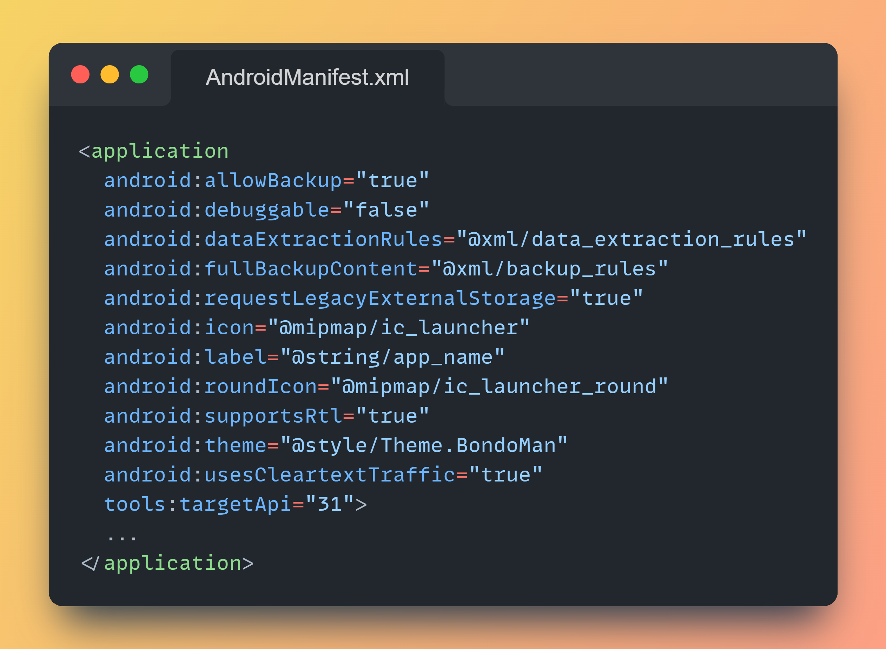
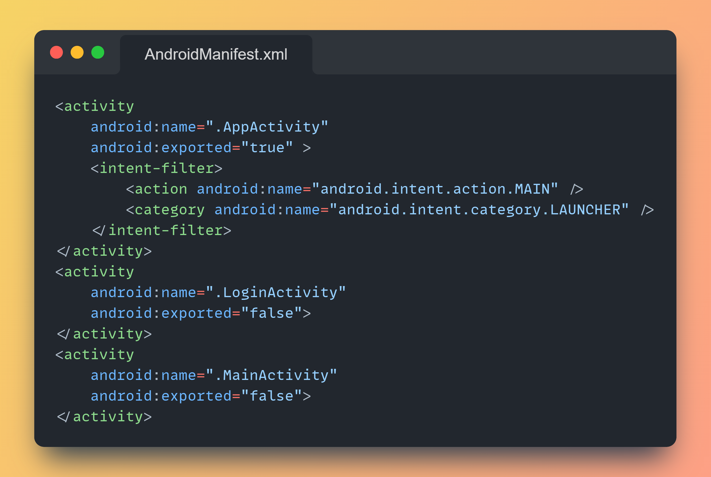
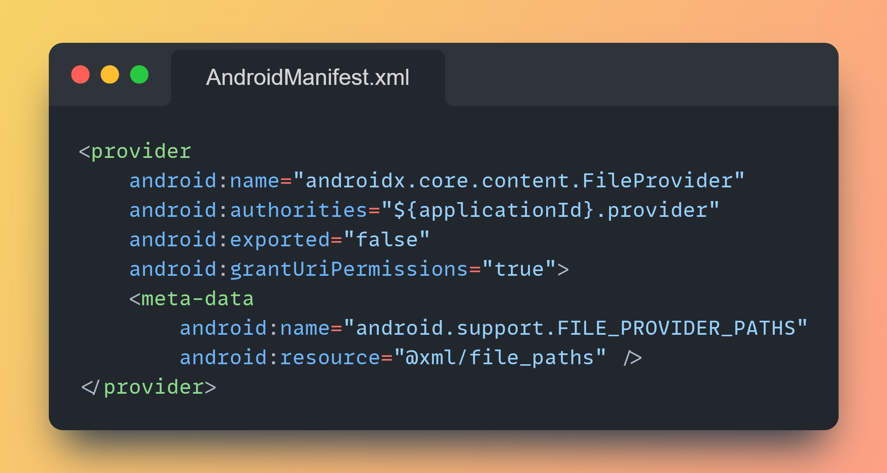
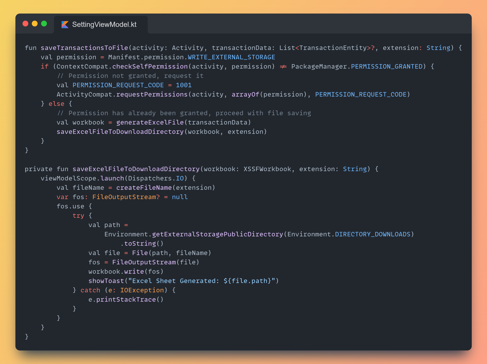

 

    

        
    

    

            <h3>BondoMan</h3>
            
<i>Transaction logging app for raw material trades</i>

    
      

 

<h1 align="center">BondoMan Mobile Application</h1>

BondoMan is an application centered around managing transactions efficiently. Users are required to log in initially to access its features, with the endpoint providing a token upon successful login for further access. The app enables users to manipulate transaction data, including addition, modification, and deletion, with minimal input requirements such as transaction title, category (Income, Expense), amount, and location, automatically recording the transaction date and user's location if permitted. Transactions are stored in Room using the Repository Pattern for offline access, displaying them comprehensively with details like transaction category, amount, name, location, and date. Users can add transactions, scan receipts, view transaction summaries via graphs, and export transaction lists to spreadsheets (xlsx or xls) for external viewing. BondoMan also features internet connectivity checks, providing alerts when offline, and incorporates a broadcast receiver in the transaction addition fragment for receiving intents from the "Randomize Transaction" button on the Settings Page.

## 📝 Table of Contents
- [General Information](#general-information)
- [Tech Stacks](#tech-stacks)
- [Libraries](#libraries)
- [Main Features](#main-features)
- [Bonus 1 - Twibbon Feature](#bonus-1---twibbon-feature)
- [Bonus 2 - OWASP Analysis](#bonus-2---OWASP-Analysis)
- [Bonus 3 - Accessibility Testing](#bonus-3---Accessibility-Testing)
- [Task Division](#task-division)
- [Contributors](#contributors)

## 📢 General Information
Bandung Bondowoso, a project manager tasked with building a thousand temples, faces a daunting challenge. Given a project by Roro, who lacks understanding in project management triangles—budget, deadline, and quality—Bondowoso must complete the monumental task within a single night with limited budget and high-quality expectations. Amidst numerous transactions for purchasing raw materials, precise cost calculations are crucial to align with the initial budget plan, as Roro refuses to pay otherwise. Initially, Bondowoso records all transactions on stone tablets, but with the immense scale of the project, he seeks assistance from the Jin students at the Institute of Jin in their sixth semester to develop a financial management application. He trusts that they possess the intelligence to tackle such a task.

The application built for Bondowoso is tailored to run seamlessly on his Android device, aiding him in managing his finances for the temple construction project. With a focus on tracking transactions, ensuring budget compliance, and facilitating efficient resource allocation, the app is designed to alleviate Bondowoso's burden and streamline the financial aspect of the project. By providing a user-friendly interface for recording transactions, analyzing expenses, and generating reports, the application empowers Bondowoso to make informed financial decisions, ultimately contributing to the smooth progress of the temple construction endeavor.

## 👨🏻‍💻 Tech Stacks

<kbd>

</kbd>
<kbd>

</kbd>
<kbd>

</kbd>
<kbd>

</kbd>
<kbd>

</kbd>
<kbd>

</kbd>

<h4>Kotlin | Google Maps | GMail | Room-SQLite | Spreadsheet | Android Studio</h4>

## 📖 Libraries
Here's list of libraries that used in this project.
<table style="width:100%">
  <col width="35%">
  <col width="65%">
  <tr>
    <th>Libraries</th>
    <th>Purposes</th>
  </tr>
  <tr>
    <td>com.squareup.retrofit2</td>
    <td>Type-safe HTTP client for Android for making HTTP requests to a RESTful API.</td>
  </tr>
  <tr>
    <td>androidx.recyclerview</td>
    <td>Efficiently display large sets of data in a scrollable list or grid format while minimizing memory usage and improving performance.</td>
  </tr>
  <tr>
    <td>androidx.camera</td>
    <td>High-level API for accessing device cameras and implementing common camera features such as preview and image capture.</td>
  </tr>
  <tr>
    <td>org.jetbrains.kotlinx:kotlinx-coroutines</td>
    <td>Provides support for Kotlin coroutines, which are a powerful concurrency design pattern used for asynchronous programming.</td>
  </tr>
  <tr>
    <td>androidx.room</td>
    <td>Provide an abstraction layer over SQLite, making it easier to work with a SQLite database within application.</td>
  </tr>
  <tr>
    <td>org.apache.poi</td>
    <td>Provide Java libraries for reading and writing various Microsoft document formats, such as Excel spreadsheets (.xls and .xlsx).</td>
  </tr>
  <tr>
    <td>com.google.android.gms:play-services-location</td>
    <td>Providing a comprehensive set of APIs for location awareness, geofencing, activity recognition, and location updates.</td>
  </tr>
  <tr>
    <td>com.github.PhilJay:MPAndroidChart</td>
    <td>Serves the purpose of providing a versatile and customizable charting library for Android applications.</td>
  </tr>
</table>

And some **android core libraries** like appcompat, constraintLayout, livedata, viewmodel, fragment, navigation, and many more!

## ⭐ Main Features
Here's BondoMan main features and its interface.
<table style="width:100%">
    <col width="24%">
    <col width="24%">
    <col width="24%">
    <col width="24%">
    <tr>
        <td width="1%"></td>
        <td width="1%"></td>
        <td width="1%"></td>
        <td width="1%"></td>
    </tr>
    <tr>
        <td width="1%">Splash Screen</td>
        <td width="1%">Login Page</td>
        <td width="1%">Transaction Page</td>
        <td width="1%">Insert New Transaction Page</td>
    </tr>
    <tr>
        <td width="1%"></td>
        <td width="1%"></td>
        <td width="1%"></td>
        <td width="1%"></td>
    </tr>
    <tr>
        <td width="1%">Update Transaction Page</td>
        <td width="1%">Get Transaction Location</td>
        <td width="1%">Transaction Graph Page - Potrait</td>
        <td width="1%">App Setting Page</td>
    </tr>
    <tr>
        <td colspan="2" width="2%"></td>
        <td width="1%"></td>
        <td width="1%"></td>
    </tr>
    <tr>
        <td colspan="2" width="2%">Transaction Graph Page - Landscape</td>
        <td width="1%">Scan Notes Page</td>
        <td width="1%">Scan Result View</td>
    </tr>
    <tr>
        <td width="1%"></td>
        <td width="1%"></td>
        <td width="1%"></td>
        <td width="1%"></td>
    </tr>
    <tr>
        <td width="1%">Delete Transaction Popup</td>
        <td width="1%">Upload Notes to Scan</td>
        <td width="1%">Send Transaction List</td>
        <td width="1%">Randomize Transaction Result</td>
    </tr>
</table>

## 🤳 Bonus 1 - Twibbon Feature
<table style="width:100%">
    <col width="32%">
    <col width="32%">
    <col width="32%">
    <tr>
        <td width="1%"></td>
        <td width="1%"></td>
        <td width="1%"></td>
    </tr>
    <tr>
        <td width="1%">Twibbon Page</td>
        <td width="1%">Twibbon Result #1</td>
        <td width="1%">Twibbon Result #2</td>
    </tr>
</table>
// TODO : Explain how this works

## 💥 Bonus 2 - OWASP Analysis
OWASP (Open Web Application Security Project) Top 10 is a list of the ten most critical application security risks. Here is our analysis on 3 of them and how we address those security vulnerabilities.

### 🔒 M8: Security Misconfiguration
Security misconfiguration in mobile apps refers to the improper configuration of security settings, permissions, and controls that can lead to vulnerabilities and unauthorized access. Threat agents who can exploit security misconfigurations are attackers aiming to gain unauthorized access to sensitive data or perform malicious actions. Threat agents can be an attacker with physical access to the device, a malicious app on the device that exploits security misconfiguration to execute unauthorized actions on the target vulnerable application context.

Security misconfigurations in mobile apps can be exploited through various attack vectors, including:
- **Insecure default settings**: Mobile apps often come with default configurations that may have weak security settings or unnecessary permissions enabled, making them vulnerable to attacks.
- **Improper access controls**: Misconfigured access controls can allow unauthorized users to access sensitive data or perform privileged actions.
- **Weak encryption or hashing**: Improperly implemented or weak encryption and hashing algorithms can be exploited to gain access to sensitive information.
- **Lack of secure communication**: Failure to use secure communication protocols, such as SSL/TLS, can expose sensitive data to eavesdropping and man-in-the-middle attacks.
- **Unprotected storage**: Storing sensitive data, such as passwords or API keys, in an insecure manner, such as plain text or weakly encrypted, can lead to unauthorized access.
- **Insecure file permissions**: Storing application files with world-readable and/or world-writable permissions.
- **Misconfigured session management**: Improper session management can result in session hijacking, allowing attackers to impersonate legitimate users.

Here is how we adress the vulnerabilities.
1. **Debugging Enabled in Manifest**
To prevent exposing sensitive information in debug mode, set `android:debuggable="false"` in the application tag of the AndroidManifest.xml file.

2. **Unprotected Exported Components**
To protect activities from unauthorized access, set `android:exported="false"` for activities that don't need to be accessed by other applications.

3. **Improper Content Provider Permissions**
Limit access to content providers by setting appropriate permissions and ensuring `android:exported="false"` unless necessary for external access.

4. **Improper Content Provider Permissions**
Utilize internal storage or external storage with proper permissions. Before write to user's external download directory, we ask the user permission first. If the user permissions has already been granted then proceed the file saving.
